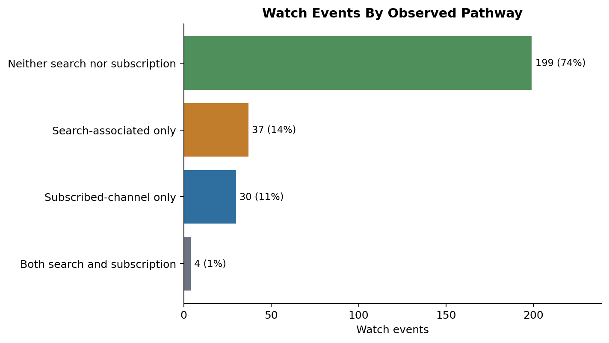
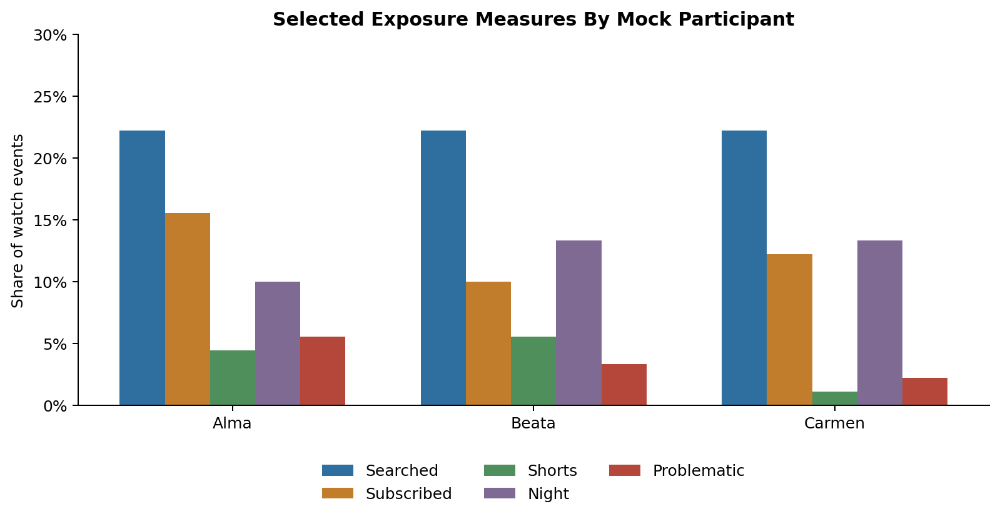
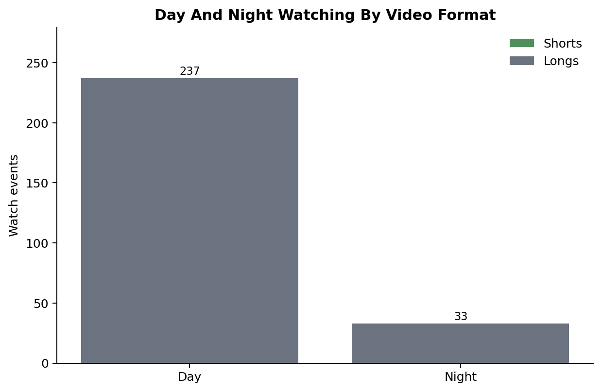
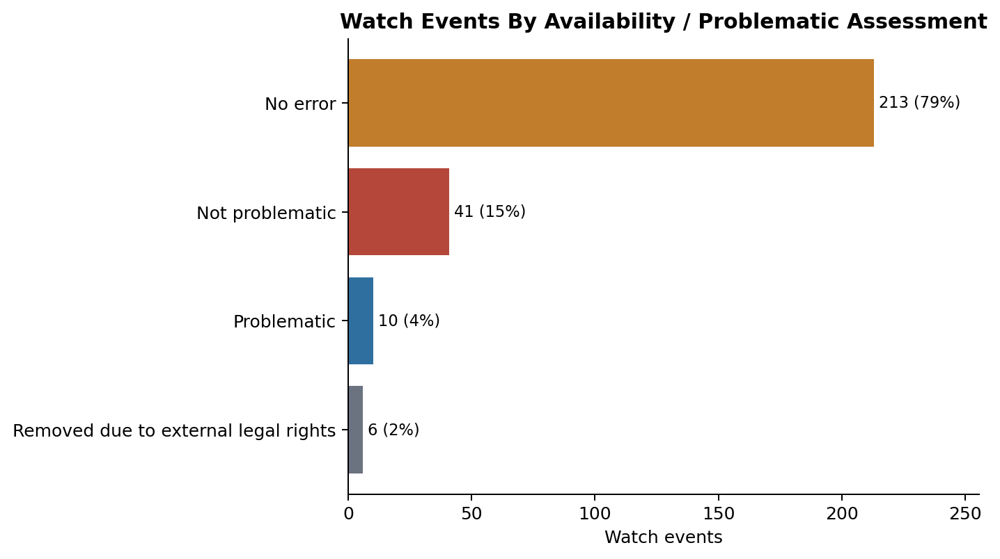

This repository demonstrates how donated YouTube account data can be linked with video- and channel-level platform metadata to create **enriched exposure histories**.

The project accompanies the method described in *Enhancing YouTube Data Donations With Platform Metadata*. It shows, in reproducible form, how researchers can move from raw Google Takeout-style files, as obtained via data donations, to event-level indicators of YouTube exposure: what was watched, when it was watched, estimated watch time, whether it followed a search, whether it came from a subscribed channel, whether it was a Short or Long, and whether later metadata collection suggests that a video became unavailable for potentially problematic content-related reasons. For demonstration purposes this repository uses **synthetic mock data**.

## Purpose

YouTube watch histories are valuable for media, journalism and platform research because they record concrete viewing behavior over time rather than recall and report biased self-reports, aggregate platform metrics, or metadata by themselves. On their own, however, donated watch histories are sparse.

This project shows how those traces can be enriched by joining them with video-level metadata through the YouTube `video_id`. After enrichment, each watch event can be analyzed not only as a timestamped view, but as part of a wider exposure history containing information about video format, channel context, likely viewing pathway, availability status, and time of day. In aggregate this allows inference not only on when but also on how data donors used the platform and provides additional information on what the people encountered.

The workflow is meant for researchers who want to understand or adapt a data donation pipeline for YouTube-related research, especially in journalism studies, platform accountability research, computational social science, and media-use research.

## What This Repository Demonstrates

The repository shows how to:

- clean donated YouTube watch, search, and subscription files;
- extract and standardize YouTube `video_id`s across donated files;
- prepare a video-level metadata table;
- join donated histories and metadata at the event level;
- classify watches as search-associated or subscription-linked where possible;
- distinguish Shorts from Longs using metadata-derived rules;
- classify viewing as daytime or nighttime according to a configurable time window;
- estimate watch time from metadata duration and the next observed watch event;
- attach availability and problematic-view indicators based on metadata/error signals;

The goal is not to reconstruct every individual viewing decision. YouTube does not provide authoritative explanations for why a specific video appeared in a user's history and we have no access to what a given video meant to a given viewer at time of viewing. However, the workflow produces **aggregate exposure indicators** that allow insight into how YouTube use differs across users.

## What Enrichment Adds

A raw watch-history row tells us that a participant started watching a video at a particular time. After enrichment, the same row can also include:

- video duration;
- channel and channel identifier;
- upload date;
- estimated watch time;
- view, like, and comment metadata;
- language, format, aspect ratio, and other video-level fields;
- whether the video is classified as a Short or Long;
- whether the watch happened during the configured day or night period;
- indication of whether the watch followed an explicit search;
- indication of whether the video came from a channel the user is subscribed to;
- whether a watched video was later removed by YouTube;
- whether the removal was due to potentially problematic content of the video

These data can then be used for user-level assessments like:

- share of searched or subscribed watches among all watches
- estimated watch time across participants, formats, and routines
- distribution of Shorts/Longs across day/night watches
- frequency of encountering potentially problematic content

These indicators are imperfect but useful. They are strongest when used to describe patterns across many events or participants, rather than to make definitive claims about single views. The figures below exemplify how the data can be used to quantify YouTube usage and identify differences between individual data donors. These examples are illustrative outputs from the synthetic mock data.

::: {layout-ncol="2"}







:::

## Workflow

```{mermaid}
flowchart TD
  A["Mock Google Takeout-style data<br/>watch histories, search histories, subscriptions"] --> B["Clean donated histories"]
  C["Video-level metadata<br/>scraped metadata or public demo fixture"] --> D["Prepare metadata table"]
  B --> E["Join by YouTube video_id"]
  D --> E
  E --> F["Event-level enriched watch history"]
  F --> G["Estimate watch time<br/>from duration and next observed watch"]
  F --> H["Compute exposure indicators<br/>search, subscriptions, Shorts/Longs, day/night, availability"]
  G --> I["Showcase tables and figures"]
  H --> I
```

## Recommended Entry Point

For a quick overview of the finished workflow, start with:

[Notebook 06: Demonstrate enriched exposure measures](scripts/06_demonstrate_enriched_exposure_measures.html)

This notebook shows the final enriched data structure and produces compact figures that illustrate what the method makes visible.

Then use the [notebook guide](notebooks.html) to inspect the earlier steps in order: cleaning donated histories, preparing metadata, demonstrating scraping logic, linking records, estimating watch time, and producing the final exposure measures.

## Mock Data

The mock dataset contains three fictional donors: Alma, Beata, Carmen. Each donor folder contains small watch-history, search-history, and subscription files with the same broad structure as a YouTube Takeout export. The public identifiers and text fields are synthetic. Video IDs, titles, channel IDs, channel names, search queries, tags, and URLs have been replaced with deterministic fake values.

## Legalities of Metadata Collection

[Notebook 03](scripts/03_scrape_youtube_metadata.html) demonstrates the metadata collection logic used in the method. In a real research project, metadata collection requires careful legal, ethical, and institutional assessment. It may also depend on the researcher's access rights, data security setup, and platform access conditions.

One route to obtain research access to YouTube is the Digital Services Act Article 40(12) for research with a systemic risk focus. Access can be requested via this [request records form](https://requestrecords.google.com/researcher) and requires provision of the scraper's IP and a *product token string* for authentication. Researchers with access can make themselves identifiable to YouTube by using their product token string as `IDENTIFYING_USER_AGENT` when scraping.

An example of a successful data access request can be found [here](https://github.com/2U2N/GRPA_YT/blob/main/GRPA_Share_Copy.pdf).

For further support in requesting data access under Article 40 of the Digital Services Act (DSA), the [DSA Collaboratory](https://dsa40collaboratory.eu/) is highly recommended.

## Repository

The source repository is available at <https://github.com/2U2N/YouTube-donation-plus-dsa>.

## Authorship and Responsibility

I, [David Wegmann](https://2u2n.github.io/Website_David_Wegmann/), developed this data enrichment workflow and this website as part of my PhD studies in the DFF-funded [Social Media Influence](https://datalab.au.dk/projects/social-media-influence) project at [DATALAB](https://datalab.au.dk), Aarhus University. Marcus Olesen, Andreas Hyldegaard and Ulrich Karstoft have contributed immensely to the development of data scraping and parsing scripts.

YouTube data is not produced for research purposes, and interpreting scraped platform data often requires substantial (informed) guesswork. The results should therefore be treated with caution, and the interpretations offered here should not be understood as definitive. Donated and scraped data must be handled responsibly, as both may contain deeply personal traces of people’s lives, including traces created without any awareness that they could later become research data.